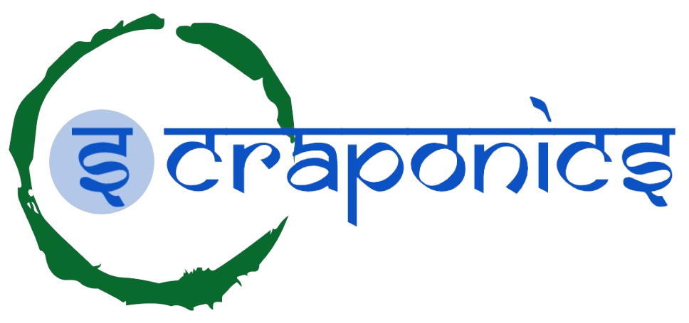

<h1 align="center">
  
</h1>

Table of Contents

- [About](#about)
  - [Motive](#Motive)
- [Tech Stack](#tech-stack)
- [tools](#tools)
- [Scraponics Repositories](#folder-structure)
  - [Frontend](#frontend)
  - [Backend](#backend)

---

## About

<table>
<tr>
<td>

The Ewaste Scraponics Project functions as a unified platform, connecting
individuals, organizations, and vendors. Through the Scraponics platform,
stakeholders can engage in economic transactions, including buying,
selling, and donating their scrap items.
 
Scraponics presents significant potential for creating a more
sustainable future and fostering collaboration among stakeholders. By
collecting and tracking data points, it serves as a valuable resource for
awareness programs. We offer a publicly accessible dashboard where
anyone can view important parameters.
 
We advocate for a sustainable future through the implementation of
the 6 R's: Reduce, Reuse, Recycle, Refurbishment, Recover, and
Repairing Materials. The project strongly emphasizes recycling and
reduction, aligning with the principles of the Circular Economy

### Motive
- Awareness: Scraponics holds tremendous potential that can create among
the stakeholders a better sustainable future. It collects and tracks data
points which can be a base for awareness programs. We provide a public
dashboard whereby anyone can go and see important parameters.

- One Unified Platform: The Project E Waste Scraponics work as a unified
platform and hereby connects individuals, organizations, and vendors.

- Economic Activity: The Scraponics platform provides the stakeholders to
transact in economic terms. The users can buy/sell/donate their scrap
items.

- Circular Economy: We promote the concept of a sustainable future
through the 6 R's - Reduce, Reuse, Recycle, Refurbishment, Recover, and
Repairing Materials. Recycle/Reduce and the project vowed to the concept
of Circular Economy

 

</td>
</tr>
</table>

### 💻 Tech Stack:

&nbsp;
&nbsp;
&nbsp;

&nbsp;
&nbsp;
&nbsp;

### 🛠 Tools:

&nbsp;
&nbsp;
&nbsp;

### 📁 Scraponics Repository: 
- <a href="https://github.com/scraponics/scraponics__frontend">🖵 frontend<a/>
- <a href="https://github.com/scraponics/scraponics__backend">🖥️ backend<a/>
